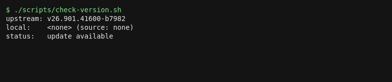

# kodex

Unofficial Linux port of the OpenAI Codex desktop app, shipped as an AppImage.

This project is not affiliated with OpenAI. The AppImage repackages OpenAI's
official macOS build for Linux. All rights to the Codex app itself belong to
OpenAI.



## Quick start

1. Download the AppImage for your machine from the GitHub Releases page.
   Pick the `x86_64` file on Intel/AMD, `aarch64` on ARM.
2. Make it executable:
   `chmod +x Codex-*.AppImage`
3. Run it:
   `./Codex-*.AppImage`

The AppImage format needs FUSE on most systems. If it does not start,
install `libfuse2` from your distro, or extract once with
`./Codex-*.AppImage --appimage-extract` and run `squashfs-root/AppRun`.

## Computer use

The bundled app can drive the desktop (screenshots plus input). X11 is the
recommended setup, since Wayland restricts background input. Run the check
script first:

`./scripts/computer-use-check.sh`

It only probes for tools. It takes no screenshots and sends no input.

Screenshot backends, first available wins:

| Tool | Session | Notes |
| --- | --- | --- |
| grim | Wayland | needs a Wayland session; region select if `slurp` is present |
| gnome-screenshot | X11 / Wayland | GNOME environments |
| scrot | X11 | X only |
| ImageMagick `import` | X11 | X only, captures the root window |

A `screencapture` shim is bundled in the AppImage. It accepts the macOS
flags agents pass (`-x`, `-m`, `-t png|jpg`) and hands off to one of the
backends above.

Two conversion notes worth knowing:

- Upstream gates startup on OpenAI's Owl Electron fork and refuses stock
  Electron. The build stubs that check (`scripts/owl-compat-patch.py`),
  which also means Help > Task Manager is a harmless no-op.
- `better-sqlite3` and `node-pty` are rebuilt for Linux in a clean staging
  directory during the build. Never `npm install` inside the extracted app
  tree: its `workspace:*` links break plain npm.

Input tools:

| Tool | Session | Notes |
| --- | --- | --- |
| xdotool | X11 | full mouse and keyboard control |
| ydotool | either | needs the `ydotoold` daemon running and access to `/dev/uinput` |
| wtype | Wayland | types into the focused window only |
| dotool | either | needs its daemon running |

Wayland limits, stated plainly: global hotkeys and background input control
do not work the way they do on X11. Screen capture goes through `grim` or
the desktop portal. Window listing and unconditional input injection are
restricted by the compositor. If computer use matters to you, run an X11
session.

## How auto-release works

A scheduled workflow (`.github/workflows/build.yml`, four times a day) runs
`scripts/fetch-upstream.py`. That script reads OpenAI's Sparkle appcasts for
both architectures and takes the newest item from each.

Tags use the scheme `vSHORT-bBUILD`, for example `v26.901.41600-b7982`,
where `SHORT` is the appcast short version and `BUILD` is the Sparkle
build number. If the two feeds disagree, the run stops instead of guessing.

If no GitHub release exists for the tag, the workflow converts the upstream
macOS zip to an AppImage and creates a release with these assets:

- `Codex-<tag>-linux-<arch>.AppImage`
- `latest.json` (tag, build, source URL, Electron version, sha256)
- `SHA256SUMS`
- `version.txt`

You can also trigger a build by hand from the Actions tab. Inputs are
`version` (tag, plain version, or `latest`), `arch` (`x64`, `arm64`), and
`src` (`zip`, `dmg`).

## Build from source

Needs: bash, python3, curl, node/npm/npx, appimagetool (fetched for you if
missing), plus python3/make/g++ for native module rebuilds. `7z` only for
`--src dmg`.

```sh
# latest upstream, x64, from the versioned zip (the default)
bash scripts/build-appimage.sh

# pinned version and arch
bash scripts/build-appimage.sh v26.901.41600-b7982 arm64

# floating DMG instead of the zip
bash scripts/build-appimage.sh latest x64 --src dmg
```

The script downloads about 600 MB of upstream zip plus a Linux Electron
runtime, rebuilds macOS native modules for Linux, and writes the AppImage
plus metadata to `dist/`. Full flags:

```sh
bash scripts/build-appimage.sh [VERSION] [ARCH] [--src zip|dmg] \
  [--electron-version X.Y.Z] [--outdir DIR] [--workdir DIR]
```

Two helper scripts:

```sh
# what did upstream publish? (always JSON)
python3 scripts/fetch-upstream.py [--arch arm64|x64|all] [--tag-only] [--json]

# am I behind? exit 0 = update available, 1 = up-to-date, 2 = error
bash scripts/check-version.sh [--json] [--upstream-tag TAG] [--workdir DIR]
```

## File layout

| Path | What it is |
| --- | --- |
| `scripts/fetch-upstream.py` | reads the appcasts, prints version JSON or tag |
| `scripts/check-version.sh` | compares upstream tag against local `dist/` state |
| `scripts/build-appimage.sh` | downloads, converts, and packs the AppImage |
| `scripts/computer-use-check.sh` | probes screenshot/input/portal readiness |
| `resources/AppRun.sh` | AppImage entry point, runs Electron on the packed app |
| `resources/Codex.desktop` | desktop entry (version stamped at build time) |
| `resources/bin/screencapture` | macOS-compatible capture shim |
| `.github/workflows/build.yml` | scheduled check, build, and release jobs |
| `assets/demo.gif` | terminal recording of the check scripts |

## Upstream sources

- arm64 appcast: <https://persistent.oaistatic.com/codex-app-prod/appcast.xml>
- x64 appcast: <https://persistent.oaistatic.com/codex-app-prod/appcast-x64.xml>
- arm64 DMG: <https://persistent.oaistatic.com/codex-app-prod/Codex.dmg>
- x64 DMG: <https://persistent.oaistatic.com/codex-app-prod/Codex-latest-x64.dmg>
- Linux Electron runtime: <https://github.com/electron/electron/releases>
- appimagetool: <https://github.com/AppImage/appimagetool/releases>

The conversion recipe follows the approach of the community
`openai-codex-5.5-linux` port, reimplemented here as a script.

## License

The scripts, shim, and configs in this repo are MIT (see `LICENSE`). The
Codex application inside the AppImage is OpenAI's proprietary build and is
covered by OpenAI's own terms, not by the MIT license.
